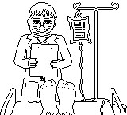

# Anubis
#visual-art #pixel-art

I made this at Game Boy dimensions; I'd like to eventually incorporate it into a game, but I don't know if that will ever happen. I actually don't even consider this image to be quite finished, but I think it's pretty good, and it's been languishing on my hard drive for a while. There's an animated version at the bottom.

![[Hospital bed, doctor, and IV bag|../img/anubis/iv-x2.gif]]

![[Chained hands, Anubis, and scale weighing feather and heart|../img/anubis/anubis-x2.gif]]

.
.
.
.
.
.
.
.
.
.
.
.
.
.
.
.
.
.
.
.
.
.
.
.
.
.
.
.
.
.
.
.
.
.
.
.
.
.
.
.
.
.
.
.
.
.
.
.
.
.
.
.
.
.
.
.
.
.
.
.
.
.
.
.
.
.
.
.
.
.
.
.
.
.
.
.
.
.
.
.
.
.
.
.
.
.
.
.
.
.
.
.
.
.
.
.
.
.
.
.
.
.

	

		
Flashing image

		
	

