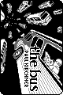
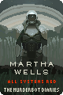
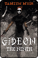
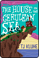
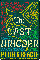
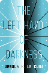
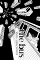
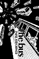
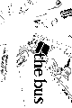

# Little Pixel Library
#club #pixel-art #visual-art

[[Little Pixel Library: Main Branch|https://hillhouse.neocities.org/cliques/library/]]

## How?
I'm extremely impressed with the art on display at the LPL. Zoom in on the images (with smoothing turned off) and you'll see that most of them are nice crisp pixels without antialiasing. It's astonishing that people can make such excellent recreations. How do they do it?! I set out to make a pixel version of _The Bus_ ([[cover|../img/clubs/library/bus/bus-cover.jpg]]) and investigate.

This post's soundtrack: https://satellitehigh.bandcamp.com/track/the-bus-is-late

First I wondered if there was some really good scaling algorithm that I didn't know about. That's not impossible, but I don't think it's a big factor even if it exists: while some covers are clearly just scaled down, most of them show signs of being hand-crafted. Still, I had to play with it. Scaling down my cover in Gimp with no interpolation produced an ugly mess. Enabling linear or cubic interpolation produced roughly identical results, looking like this (all examples displayed at x4):

It looks great at its original size, of course, but as soon as you look closer it all falls apart. Manual intervention is needed if we want those nice sharp jaggies. But how much? I thought about starting from scratch, but I just wasn't feeling it; I felt overwhelmed, maybe because I had chosen a black and white cover (limiting your palette limits detail just like limiting your resolution). I thought about tracing it using [[Piko Pixel|https://twilightedge.com/mac/pikopixel/]], and even started on it, but that wasn't hitting either. Can I be lazy? Can I find something close to the mythical scaling algorithm?

First I tried various dirty tricks to reduce the number of colors in the scaled-down image, hoping to hit on something that would crisp up the lines without looking awful, or at least get me to a comfortable starting point with only a few shades of gray in the palette. After layering different scaling algorithms on top of each other at different opacities; going through many iterations of Colors -> Posterize; setting it to RGB then back to indexed with one less color, then repeating the process; adjusting color levels; etc... I ended up with this four-color image as my starting point:

It already looks better than just scaling it down, though I think that's mostly down to playing with the levels. But again, while it looks great at 1x, all the details are smeared together when you zoom. I considered leaving it here, but I wasn't satisfied. I hadn't done enough. It didn't feel like art, and it certainly wasn't up to the standard set by other LPL contributors.

So it was time to roll up my sleeves and get arting. But I still felt out of my element, like I was missing a key ingredient. (I mean another one besides talent.) What is the workflow? How do they do it?!

The eagle-eyed reader will notice that the author's name is clearly legible in a pixel font here, unlike the one that was just scaled down. That's because I managed to lose the actual plain base image and could only find this one where I had merged in my replacement text. This is an obvious step to take: slightly blurry images look much better than blurry text, which you can easily replace. Going back to the LPL, I noticed several examples that look fantastic stopped at this point. They've scaled down the cover, redrawn the text, and called it good. The image artifacting is subtle and the words are crispy.

But they aren't the best ones. So I proceeded to draw the rest of the horse.

I figured since I had my decent starting point, I would just touch up the muddy areas until it looked good. While that helped, in some places a touch-up just wasn't doing the trick and it really needed to be totally redrawn. In particular, I wanted the man to be clearly visible, but there was so much detail there that had been lost I didn't seem to be making any headway with the touch-up approach. When I've made pixel art in the past, one of the enjoyable aspects has been simplification. It actually helps to do the thing that you really aren't supposed to do when you draw: draw what you *think* you see instead of what you *actually* see. Pixel art is a sort of visual shorthand. It's more important for it to be quickly recognizable than realistic.

So, I deleted the window beam in front of the man. It's just too hard to discern any of his details otherwise. It's fine, this bus just has big windows, deal with it. I took similar liberties with the rest of the image, which is to say with the buses. The window along the top no longer has any dividers and is more like a racing stripe. The lines along the panel have turned into a checkerboard. Buses in the background are larger, their windows arranged differently. I particularly tried to make the wheels more clearly distinguished from the rest of the bus in hopes that would make them more recognizable.

I focused my efforts on the foreground details that matter more. The really small ones in the back I left alone because I really had no idea what could be done about them. I just don't think there are enough pixels to make them anything but blobs. Since they're gonna be blobs anyway, let's trust the scaling algorithm to make them slightly more interesting blobs.

All told, here's what I drew (except the author's name, as noted above):

That doesn't look like much, but I think it made a big difference. Here's the final version at 4x:

I still have no idea how the masters are doing it, but I'm pretty happy with the results of this workflow. It's crispy yet detailed, and I didn't have to do much work but still got to be creative.

Anyway, I'm obviously not a pro. You can judge for yourself if it's any good. I just wanted to share my workflow for anyone else wondering "how did they do that?"
