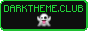

# About pnppl.cc
#meta

> She started keeping a journal — had been, in fact, secretly doing so for some time: the furtive act of a deranged person.
— [[PKD|http://annas-archive.gl/search?q=valis]]

## Welcome!
Welcome to my [[commonplace.|http://en.wikipedia.org/wiki/Commonplace_book]] It's also, perhaps, my digital garden? I won't be offended if you just call it my blog.

I've been a prodigious note-taker for years. Being able to carry my notes with me and search them digitally means I can actually refer back to them, and often do. It recently occurred to me that some of these notes (when tidied up a bit) might be of interest to other people. I call this site a commonplace because it's an attempt to translate that existing practice into a public form.

I also write stuff that I don't refer to but is hopefully valuable in other ways: fiction, essays, code, etc. And since I'm at it anyway, I might as well post art I make that doesn't fit in a text file.

I hope that sharing my commonplace publicly will encourage me to write more, more intentionally, for a wider audience. It would be especially nice if it made me actually document my tech projects so I don't have to re-figure them out whenever I come back to them after a long time. I said I was a prodigious note-taker, not a good one.

I would love to get an email from you! [[comments@pnppl.cc|mailto:comments@pnppl.cc]]

## Copyleft
Intellectual property is a fake idea; unfortunately, we live in a world where it reigns supreme. Copyleft gives us a tool to turn copyright against itself. It means that you can do whatever you want with the content of this site, as long as you extend the same right to others.

This site's content is licensed [[CC BY-SA 4.0|https://creativecommons.org/licenses/by-sa/4.0/]] ([[license text|../public/CC_BY-SA_4.0.txt]]) with the attribution requirement waived, unless otherwise specified. If this causes issues for you, let me know and I'll probably be happy to do a public domain declaration.

Code that I share here is [[AGPLv3|https://www.gnu.org/licenses/agpl-3.0.en.html]] ([[license text|../app/AGPL-3.0.txt]]) if unspecified. The code used to build the site is covered by other licenses.

## Install Victor Mono
This site really looks much better in [[Victor Mono.|http://rubjo.github.io/victor-mono/]] It's my favorite font. Even though it's monospace, it's a pleasure to read.

I could force it on you, but I find that rude. I block remote fonts in my browser: they're usually hosted on Google's CDN, so they call home; they're a big blob you have to download just to read some text; and they don't respect your preference of default font. So, please install it. I promise you'll like it.

Unfortunately, if you're on an Android phone, I think you have to be rooted to install a font and it's a big pain in the ass. So, I do try to load it on mobile with a media query. You'll just have to block it if you hate it.

## Hotkeys
Buttons with underlined letters can be activated using that letter as the hotkey; [[exactly how depends on the browser.|https://developer.mozilla.org/en-US/docs/Web/HTML/Reference/Global_attributes/accesskey#:~:text=The%20way%20to%20activate%20the%20accesskey]] On Firefox it's alt-shift-hotkey. You can also navigate through headings with alt-shift-number, but it's currently rather buggy.

## Memberships

        

## We have to go deeper: technical details, etc.
My goal is to have to change as little as possible about my existing approach to writing: plaintext, formatted in whatever way feels right, written in my notes app or shell. I'd like for the software to adapt to me, not the other way around. My one concession is Markdown. I don't really like it, but it's cornered the market, and it's close enough that I'm willing to bend a little. Extensions make it much less painful — particularly Wikilink syntax support. The text files that pnppl.cc is built from are the One True Commonplace, with the website providing some extra features that are nice to have but not required. You can access the original text file for a post with the _txt_ button in the top right corner.

You can also access them through [[the|https://git.gay/pnppl/pnppl.cc/]] [[git|https://codeberg.org/pnppl/pnppl.cc]] [[repo|https://github.com/pnppl/pnppl.cc]], which handily doubles as a version history and complete source of the site. If you just want to grab all the posts in plaintext, that's at [[../txt/!txt.zip]].

pnppl.cc does not use any Javascript except for the Search page.[^js] It's a necessary compromise. If you want to search without enabling js, you can grab the text files and search them locally. This is easily accomplished in the shell, eg `grep -i "search term" *.md`. I like [[ripgrep.|http://github.com/BurntSushi/ripgrep]]

A major goal I have is for the site to be usable as plain HTML. The sites that have stood the test of time, that still display perfectly and are a pleasure to read, are all plain old HTML. (Usually hosted on URLs like `http://lab.cs.mit.edu/faculty/~johnsmith` and miraculously preserved in their entirety by the Wayback Machine.) As a fan of retrocomputing, I'd also like to be able to access my site on anything with a web browser, and trying to accomplish that level of compatibility is the stuff of web design nightmares... unless it's just plain old HTML. To that end, I've been testing the site in progress on NCSA Mosaic v2.7b6. Sure, it's the last version... but it's the last version of the *first* major browser, and [[I can run it on my computer.|http://github.com/AppImageCommunity/NCSA-Mosaic-AppImage]] I figure if it works in Mosaic, it ought to work in anything. HTML is wonderfully resilient. Pretty much every browser ever made happily displays malformed HTML without issue. Modern browsers still render supposedly obsolete tags just fine, and Mosaic will just ignore tags it doesn't understand.

With legacy [[compatibility|compat]] covered, we can use stylesheets to make the site pretty on a modern browser, since CSS doesn't make them slow to a crawl or execute arbitrary code. Now, I *hate* web design, and I find CSS particularly frustrating, so I've relied on the stylesheet that xlog came with as a starting point. It used a big framework and weighed in at nearly a megabyte, but I've got it pared down to about 20K now. It handles dark mode, responsiveness, etc., which all sounded exhausting to do from scratch.

I selected [[Xlog|http://github.com/emad-elsaid/xlog]] as the best static site generator for my requirements: everything I cared about still worked with Javascript disabled and it supported must-have features: backlinks and mentions. (The way mentions work is that when the name of a post is used in another post, it's automatically turned into a link. Backlink support adds a section at the foot of a post that lists all the other posts that link to it.) If I'm going hypertext, I want all the benefits, but I also don't want to spend a lot of time fussing over the website when it's the words that really matter. And given the wide variety of subjects, it would be nice to have some ability to discover posts.

For mentions, the underline is broken with dashes to de-emphasize it and so you can distinguish it from a manual link. Links to glossary entries have a dotted underline and you can hover them to see the definition. [[External links|http://web1.0hosting.net/]] are followed by a % sign, because it kind of looks like an X and also kind of like the little external link symbol a bunch of sites use. I wanted to keep it ASCII when possible, as well as webfont-free. ([[Email,|mailto:comments@pnppl.cc?subject=I read the entire about page!]] [[torrent magnet,|magnet:?xt=urn:btih:3b1de9cb7011350fa152ec47419620aa153e19e7&dn=debian-13.4.0-amd64-netinst.iso]] [[PDF,|https://www.bmj.com/content/bmj/363/bmj.k5094.full.pdf]] [[Wikipedia,|https://en.wikipedia.org/wiki/Emperor_Norton]] and [[YouTube|https://www.youtube.com/watch?v=DKaqaToa4mQ]] links have their own annotations.)

Still, I'm not quite willing to give up UTF-8 for my posts. UTF-8 is so good. I'm addicted to the emdash. Sometimes I even use an emoji. I figure a garbled character here and there in the unlikely event that someone actually uses Mosaic or another legacy browser is an acceptable sacrifice, and I've tried to ameliorate the issue by outputting ASCII versions of commonly used characters that degrade cleanly, like the emdash, ≠, etc. With CSS enabled you'll still see the original character.

## Credits
I'd like to extend my heartfelt gratitude to the following people who made pnppl.cc possible:
- [[Emad Elsaid|https://www.emadelsaid.com/]] for creating [[Xlog|https://github.com/emad-elsaid/xlog]]
- [[Yusuke Inuzuka|https://github.com/yuin]] for creating [[goldmark|https://github.com/yuin/goldmark]] and other Xlog dependencies
- [[Abhinav Gupta|https://github.com/abhinav]] for creating [[goldmark-toc|https://github.com/abhinav/goldmark-toc]] and [[goldmark-wikilink|https://github.com/abhinav/goldmark-wikilink]]
- [[rubjo|https://github.com/rubjo]] for creating [[Victor Mono|https://rubjo.github.io/victor-mono/]]
- [[Liam Bigelow|https://github.com/bglw]] for creating [[Pagefind|https://pagefind.app/]]
- [[John MacFarlane|https://johnmacfarlane.net/]] for creating [[Pandoc|https://pandoc.org/]]
- [[Matteo Paonessa|https://github.com/Lymphatus]] for creating [[Caesium|https://github.com/Lymphatus/caesium-clt]]
- [[Felix Hanau|https://github.com/fhanau]] for creating [[Efficient Compression Tool|https://github.com/fhanau/Efficient-Compression-Tool]]
- Everyone else who contributed to the above free and open-source projects and their dependencies
- [[besties collective|https://besties.house/]] for providing gratis source code hosting and version control at [[git.gay|https://git.gay/]]
- [[Web 1.0 Hosting|//web1.0hosting.net/]] for providing gratis retro-compatible webhosting and email

I'm also immensely grateful to the people behind the following software instrumental to making this site and maintaining my thin sliver of sanity:
- [[Debian|https://www.debian.org/]] operating system
- [[Xfce|https://xfce.org/]] desktop environment
- [[Chicago95|https://github.com/grassmunk/Chicago95]] desktop theme
- [[fish|https://fishshell.com/]] command shell
- [[Termux|https://termux.dev/]] terminal/Linux environment for Android
- [[nano|https://www.nano-editor.org/]] text editor
- [[Markor|https://github.com/gsantner/markor]] text editor for Android
- [[GIMP|https://gimp.org/]] image editor
- [[Gifsicle|https://www.lcdf.org/gifsicle/]] gif compressor
- [[flexiGIF|https://create.stephan-brumme.com/flexigif-lossless-gif-lzw-optimization/]] gif optimizer
- [[lftp|https://github.com/lavv17/lftp]] FTP client

Special thanks also to the people who cultivate, harvest, process, and distribute coffee, tea, cannabis, and carrot juice.

[^js]: It's also used on a few other "special" pages.
